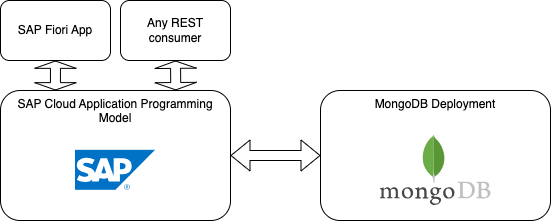

# SAP Cloud Application Programming Model (CAP) - MongoDB Handler
An unofficial SAP CAP extension to connect to any MongoDB instance.

[](https://badge.fury.io/js/cap_mdb_handler)

## Introduction

This project lets you connect to a MongoDB instance from a CAP service. It provides a simple way to read, create, update and delete documents in a MongoDB collection, which represents a CAP entity. The flexible nature of MongoDB allows you to store any kind of data, which can be accessed and manipulated using the CAP service.



All logos are trademarks of their respective owners.

## Prerequisites
- Node.js
- MongoDB instance (Get one for free at [MongoDB Atlas](https://www.mongodb.com/cloud/atlas))
- SAP Cloud Application Programming Model (CAP) (Get started [here](https://cap.cloud.sap/docs/get-started/)
- SAP Business Application Studio (BAS) or 
    - Visual Studio Code (VSCode) with the SAP Business Application Studio Extension Pack installed


## Installation
```bash
npm i cap_mdb_handler
```

## Usage
```typescript
import type { Request } from "@sap/cds/apis/services"
import cds = require('@sap/cds');

// 1. Import the MDBHandler
import MDBHandler from "cap_mdb_handler";

require('dotenv').config();

module.exports = cds.service.impl(async function () {

    // 2. Create a new instance of the MDBHandler
    const oHandler = new MDBHandler(process.env["MONGO_URL"], process.env["MONGO_DB"]);

    // 3. Register the event handlers
    this.on('READ', '*', async (req : Request) => {
        return await oHandler.read(req);
    });

    this.on('CREATE', '*', async (req : Request) => {
        return await oHandler.create(req);
    });

    this.on('UPDATE', '*', async (req : Request) => {
        return await oHandler.update(req);
    });

    this.on('DELETE', '*', async (req : Request) => {
        return await oHandler.delete(req);
    });
});
```

## Configuration
The MDBHandler requires the following environment variables to be set:
- `MONGO_URL`: The URL of the MongoDB instance (beginning with `mongodb://` or `mongodb+srv://`)
- `MONGO_DB`: The name of the database to connect to